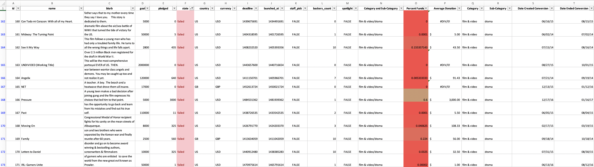
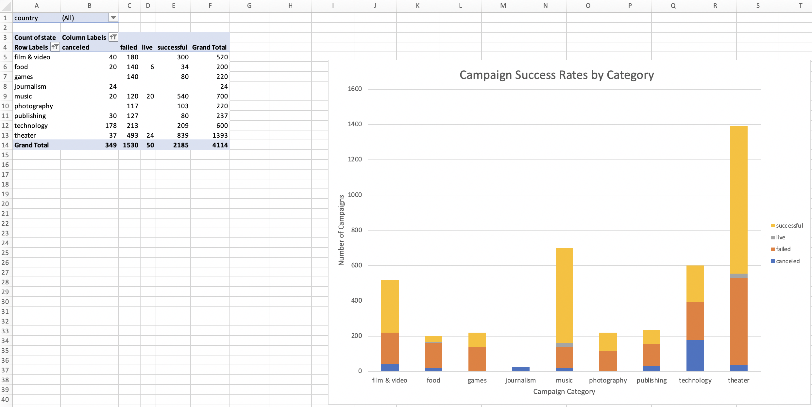
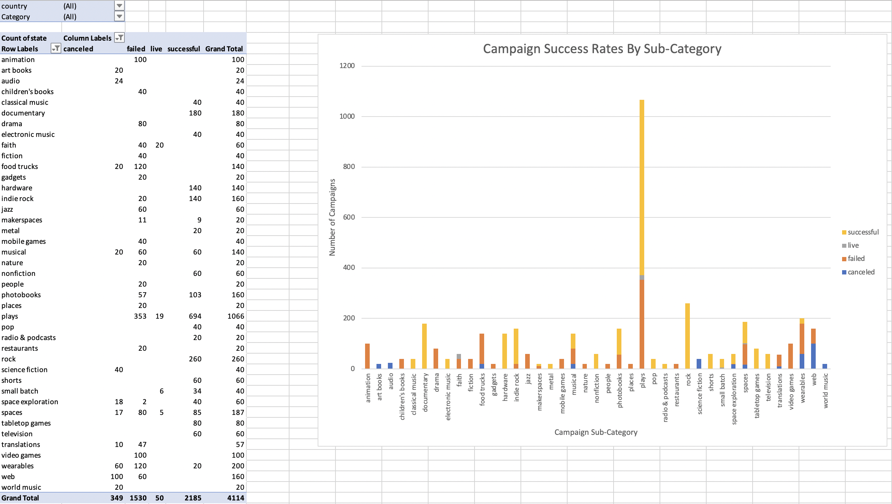
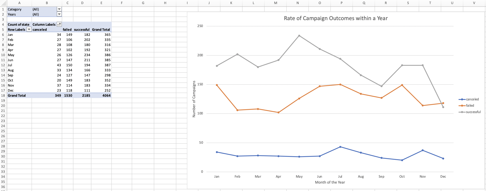
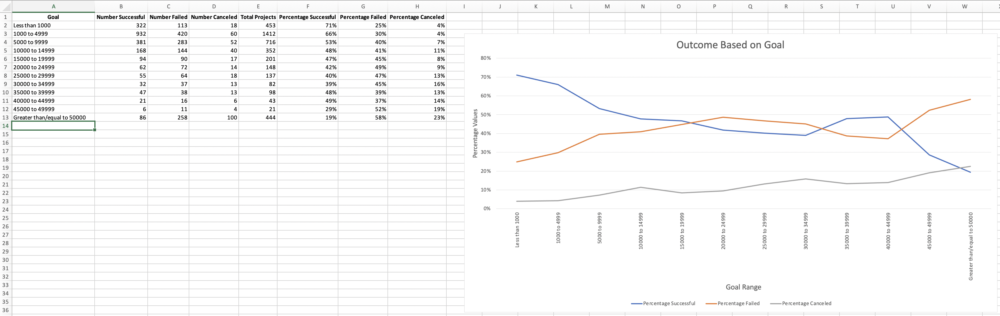
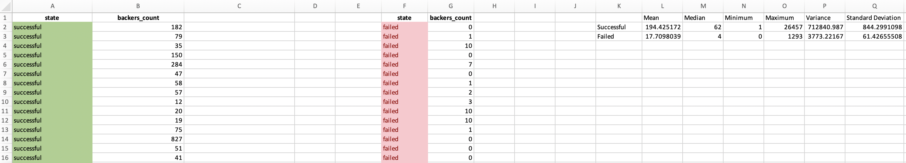

# Kickstarter Project Success Analysis

## Background Information

Over $2 billion has been raised using the massively successful crowdfunding service, Kickstarter, but not every project has found success. Of the more than 300,000 projects launched on Kickstarter, only a third have made it through the funding process with a positive outcome.

Getting funded on Kickstarter requires meeting or exceeding the project's initial goal, so many organizations spend months looking through past projects in an attempt to discover some trick for finding success. For this project, I effectively organized and analyzed a database of 4,000 past projects in Microsoft Excel in order to uncover any hidden trends.

## Initial Analysis Setup

Using the Excel table provided (https://umn.bootcampcontent.com/University-of-Minnesota-Boot-Camp/uofm-stp-data-pt-12-2020-u-c/blob/master/02-Homework/01-Excel/Instructions/StarterBook.xlsx), I modified and analyzed the data of 4,000 past Kickstarter projects in an attempt to uncover some market trends.

* I utilized conditional formatting to fill each cell in the `state` column with a different color, depending on whether the associated campaign was successful, failed, or canceled, or is currently live.

* I created a new column O called `Percent Funded` that uses a formula to uncover how much money a campaign made to reach its initial goal.

* Within the new `Percent Funded` column, I used conditional formatting to fill each cell based on a three-color scale. The scale begins at 0 with a dark shade of red, which transitions to green at 100, and blue at 200.

  * Further, I added in a new column P called `Average Donation` that uses a formula to uncover how much each backer for the project paid on average.

  * I generated two new columns, one called `Category` at Q and another called `Sub-Category` at R, which use formulas to split the `Category and Sub-Category` column into two parts.

## Category and Sub-Category Pivot Tables

* I generated a new worksheet with a pivot table that analyzed my initial worksheet to count how many campaigns were successful, failed, canceled, or are currently live per **Category**.

  * Utilizing this pivot table, I was able to create a stacked column pivot chart that can be filtered by country.

  

  * To provide a deeper analysis of campaign succses, I created a new worksheet with a pivot table that analyzed my initial dataset to count how many campaigns were successful, failed, or canceled, or are currently live per **Sub-Category**.

  * Finallu, I created a stacked column pivot chart that can be filtered by country and parent-category based on this pivot table.

  

## Datetime Conversion

* The dates stored within the `deadline` and `launched_at` columns use Unix timestamps. Fortunately, I was able to use a [ formula](https://www.extendoffice.com/documents/excel/2473-excel-timestamp-to-date.html) to convert these timestamps to a normal date.

  * I generated a new column named `Date Created Conversion` that used [this formula](https://www.extendoffice.com/documents/excel/2473-excel-timestamp-to-date.html) to convert the data contained within `launched_at` into Excel's date format.

  * I then created a new column named `Date Ended Conversion` that used [this formula](https://www.extendoffice.com/documents/excel/2473-excel-timestamp-to-date.html) to convert the data contained within `deadline` into Excel's date format.

## Campaign Outcomes Based on Launch Date

  * Within my Excel workbook, I created a new sheet with a pivot table with a column of `state`, rows of `Date Created Conversion`, values based on the count of `state`, and filters based on `parent category` and `Years`.

  * I subsequently generated pivot chart line graph that visualizes this new table.

  

## Campaign Outcomes Based on Target Goal

* I decided to utilize an additional mathematical formula and line chart graph to visualize the relationship between a goal's amount and its chances at success, failure, or cancellation. 
  
  * I addressed this by create a new worksheet with 8 columns:

    * `Goal`
    * `Number Successful`
    * `Number Failed`
    * `Number Canceled`
    * `Total Projects`
    * `Percentage Successful`
    * `Percentage Failed`
    * `Percentage Canceled`

  * In the `Goal` column, I created 12 rows with the following headers:

    * Less than 1000
    * 1000 to 4999
    * 5000 to 9999
    * 10000 to 14999
    * 15000 to 19999
    * 20000 to 24999
    * 25000 to 29999
    * 30000 to 34999
    * 35000 to 39999
    * 40000 to 44999
    * 45000 to 49999
    * Greater than or equal to 50000

* Using the `COUNTIFS()` formula, I was able to count how many successful, failed, and canceled projects were created with goals within the ranges listed above. I then populated the `Number Successful`, `Number Failed`, and `Number Canceled` columns with this data.

* I populated a `Total Projects` column which includes total values in the `Number Successful`, `Number Failed`, and `Number Canceled` columns. Then, using a mathematical formula, I calculated the percentage of projects that were successful, failed, or canceled per goal range.

* This statistical analysis is represented in a line chart:

## Campaign Backer Statistical Analysis

If one were to describe a successful crowdfunding campaign, most people would use the number of campaign backers as a metric of success. One of the most efficient ways that data scientists characterize a quantitative metric, such as the number of campaign backers, is by creating a summary statistics table.

To provide a more concrete financial analysis of these Kickstarter campaigns, I created my own summary statistics table to evaluate the number of backers of successful and unsuccessful campaigns.

* I generated a new worksheet in my Excel workbook and created a column each for the number of backers of successful campaigns and unsuccessful campaigns.

* For both successful and unsucessful campaigns, I used Excel filtering functions and statistical analysis formulas to perform the following:

  * The mean number of backers

  * The median number of backers

  * The minimum number of backers

  * The maximum number of backers

  * The variance of the number of backers

  * The standard deviation of the number of backers

  

## Final Kickstarter Project Success Report

* Within my Excel worksheet, I described why the mean summarizes the data more effectively than the median in addition to understanding the varibility between success and unsuccessful campaigns.

* I generated a final analysis summary in Microsoft word which addressed overarching aspects of this project including:

1. Three conclusions drawn based on the analysis and visualization of the datatset
2. Limitations of this dataset
3. Potential tables or figures for this analysis that can be prepared in the future

- - -

© 2019 Trilogy Education Services
